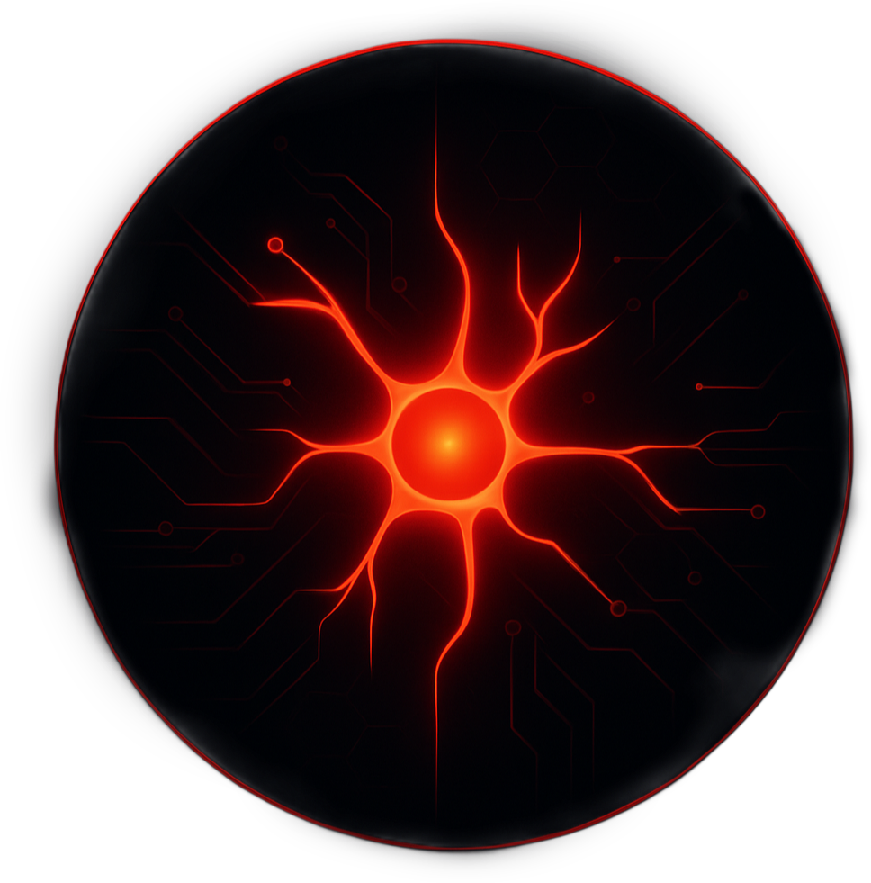

# Welcome to AI RedCell 🩸  

  

Hello and welcome!

AI RedCell is your one-stop hub for exploring AI, understanding its behavior, and diving into ethical jailbreaking. Our mission is to bring together **all learning materials, insights, and research** in one place so curious minds can experiment, explore, and grow their AI knowledge safely and responsibly.

I’m **Shehan Nilukshan**, the founder of AI RedCell.  
This space exists to empower learners, researchers, and enthusiasts to access resources, collaborate, and understand AI deeply—all from a single hub.

Whether you’re here to explore concepts, practice prompt engineering, or just satisfy your curiosity about AI, you’re in the right place.

---

## 🚀 Before We Begin: Crawl → Walk → Run  
Jailbreaking isn’t step one.  
Before you break the system, you need to **understand the system**.

At AI RedCell, we follow a structured path:

### **1. Crawl – Learn the Basics**
- What is AI?  
- How do LLMs work?  
- What is a prompt?  
- Why does prompting matter?

### **2. Walk – Understand Safety**
- Why do models refuse certain answers?  
- What are guardrails?  
- How does alignment work?  
- What is red teaming?

### **3. Run – Begin Jailbreaking**
- Jailbreak styles  
- Prompt injections  
- Payload crafting  
- Bypassing filters ethically

Our **first foundational course** (now in this repo) covers:
> **AI Fundamentals + Prompt Engineering Basics**  
Your true starting point before touching real jailbreaks.

---

## 🔗 What You’ll Find Here
- Centralized Learning Materials  
- Ethical Jailbreaking Research  
- AI Behavior Insights  
- Structured Learning Path (Zero → Hero)  
- Community Contributions  

---

## 🔥 Start Learning
Visit the website and begin the journey:  
**https://ai-redcell.github.io/**

---

> **Note:** AI RedCell focuses on **knowledge and responsible exploration**.  
> This organization does not condone illegal or harmful activities.

